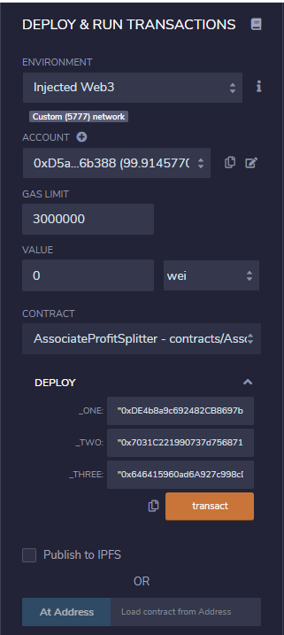
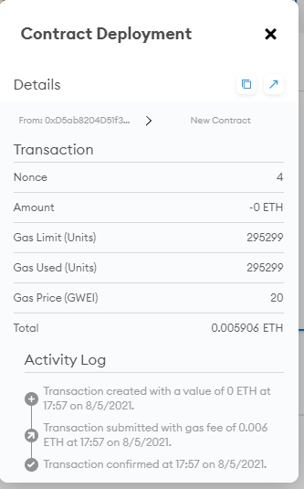
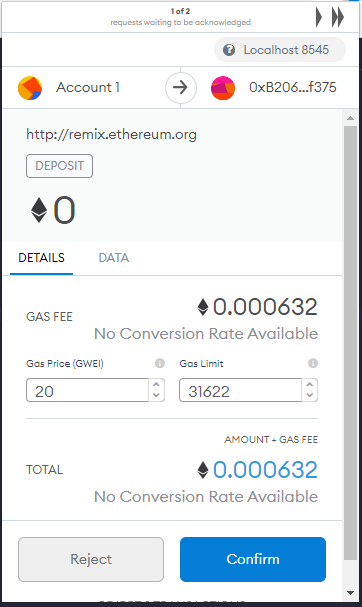
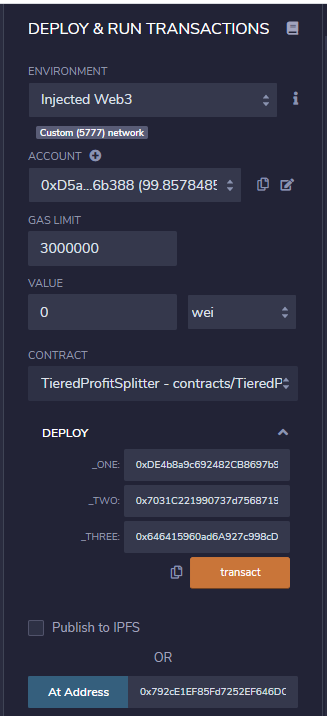
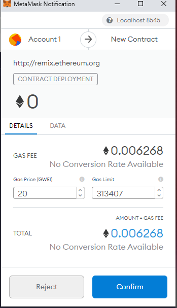
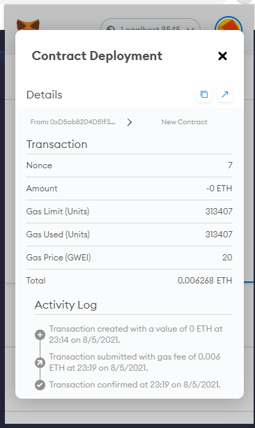
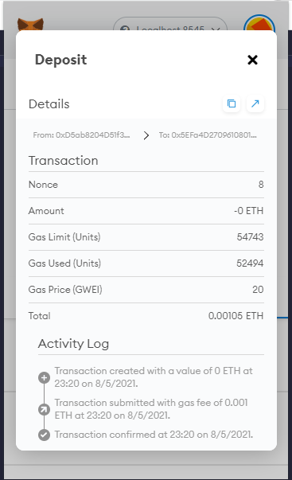
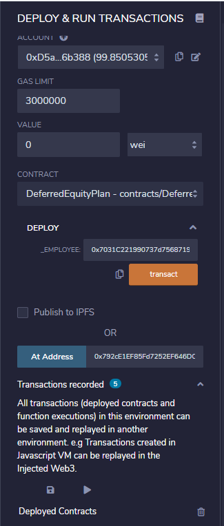
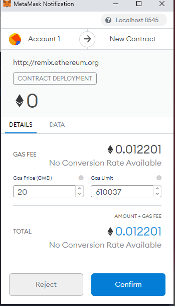

# 20-Solidity
## AssociateProfitSplitter
- The first contract is called the AssociateProfitSplitter which accept ETH and split among all three employee and also allows HR to pay employee quickly and efficiently
    * A constructor function was created for the addresses of the employee one to three.
    * A balance function was also created which is suppose to return the contract balance and also return zero in order to confirm it is executed correctly.
    * A deposit function is created so that the owner make deposit into the contract.
    * A fallback function created which make sure that deposit is excuted correctly if eth is send directly to the contract.

- The below are the parameter to deploy transaction
    

- The below screen print shows the transaction details.

- The below are the parameter to deploy deposit transaction.

- The below screen print shows the confirmation window when you will confirm the transaction.

- The below screen print shows the transaction details for deposit.

## Tieredprofit
- The second contract is called the which Tieredprofit in which the profit will be split among the employee base on percentage of the employee and the remainder is sent to the employee with the highest percentage.

    *  A constructor function was created for the addresses of the employee one to three.
    * A balance function was also created which is suppose to  return zero in order to confirm the deposit logic executed correctly.
    * A deposit function is created will transfer and calculate base on percentage, keep a running total and transfer the balance to the highest percentage.
    * A fallback created function which make sure that deposit is excuted correctly if eth is send directly to the contract.

- The below are the parameter to deploy transaction.

- The below screen print shows the confirmation window where you will confirm the transaction.

- The below screen print shows the transaction details.

- The below screen print shows the deposit transaction details

## DeferredEquityPlan
- The third contract is called the which deferred equity incentive plan in which 1000 shares will be allocated to employees over a period of 4yrs.

*  A constructor function was created for the HR address and employee.

* A distributed function that require the contract to have the following parameter
    * Require that unlock time is less than or equal to now.
    * Require that distributed shares is less than the total amount of shares set for the employee.
    * Requier an error message when requirement not met.
    * Require to add another 365 days to unlock time .

* A deactivate function created which enable either the employee or HR can deactivate at their will.

* A fallback created function which make sure that deposit is reverted if sent to the contract.

- The below are the parameter to deploy transaction

- The below screen print shows the confirmation window where you will confirm the transaction.

- The below screen print shows the transaction details.

